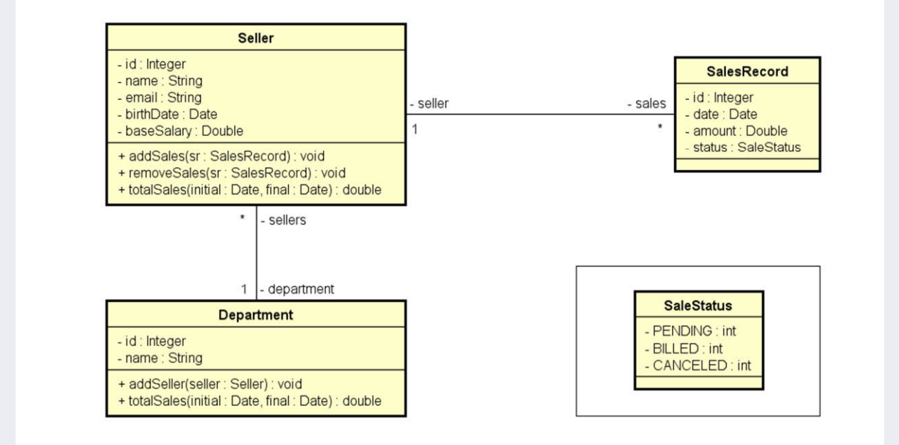

# Sales Manager

[](https://github.com/Edsogarc/SalesManager/blob/main/LICENSE)

# Sobre o Projeto
Projeto MVC construído durante as aulas do professor [Nélio alves](https://www.udemy.com/course/programacao-orientada-a-objetos-csharp/).
<p>O projeto realiza o gerenciamento de vendas por departamento e vendedor(a).</p>

<p>
  <a href="#modelo-conceitual">Modelo Conceitual</a> |
  <a href="#features">Features</a> |
  <a href="#rodando-a-aplicação">Rodando a aplicação</a> |
  <a href="#tecnologias">Tecnologias</a> |
  <a href="#autor">Autor</a>
</p>

## Layout
<!-- Department, Seller and Sales Record -->
<details>
  <summary><strong>Department, Seller and Sales Record</strong></summary>
  
  
  
  
  
  
  
  
</details>
  


## Modelo Conceitual


## Features

- [x] Theme Superhero
- [x] CRUD para o Departamento
- [x] CRUD para o Vendedor(a)
- [x] Consulta de vendas simples e agrupada por departamentos e vendedor(a)
- [x] Tratamento de Exceções

## Tecnologias

#### Back-end
- C#
- Asp-net 6
- Entity Framework Core 6
- SQL Server 2019 developer

#### Front-end
- HTML / CSS / Javascript
- bootstrap 5
- jQuery

## Rodando a aplicação
Pré-requisitos: .NET 6 e SQL Server developer<br>
Obs: necessário mudar a ConnectionStrings no arquivo appsettings.json e colocar o nome do seu servidor. 

```powershell
# Clone este repositório
> git clone https://github.com/Edsogarc/SalesManager.git

# Acesse a pasta do projeto no terminal/cmd
> cd /SalesManager

# executar o projeto
> dotnet run
```

### Autor
Edson Garcia

[](https://www.linkedin.com/in/edsongarciadesousa/)


